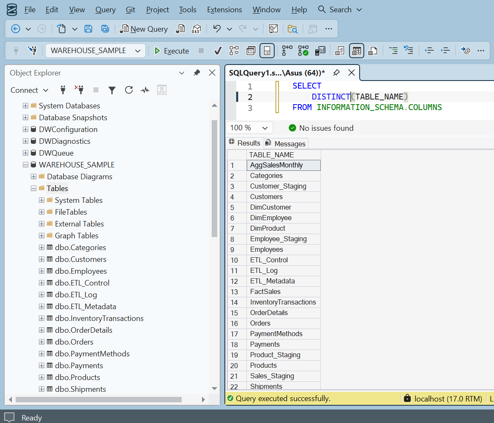
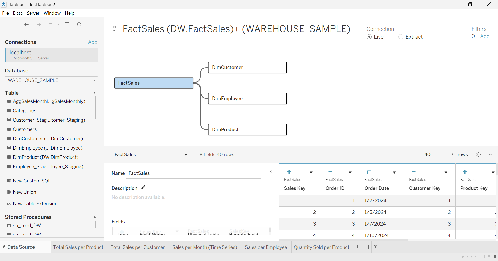

# End-to-End Sales Data Warehouse and BI Dashboard (SalesDataWarehouseTableau)

Proof of Concept of Warehouse Data Analysis in Tableau complete with ETL Logic. 
Tech: Tableau Desktop, SQL Server

This project demonstrates a complete Business Intelligence workflow, from raw database management to interactive data visualization. 

Instead of just connecting a visualization tool to a flat CSV file, I built a mini data warehouse in SQL Server using a star schema and an incremental ETL process, and then connected Tableau directly to that structured database.

## Project Overview

The goal of this project was to handle data duplication, design a proper fact grain, and build a scalable foundation for business analytics. 

## Project Structure

/sales-data-warehouse-tableau
│
├── /sql-scripts
│   └── WAREHOUSE_SAMPLE.sql
│
├── /tableau-dashboard
│   └── TestTableau2.twb
│
├── /assets
│   ├── architecture_diagram.png 
│   └── /dashboard_demo
│
├── /tutorials (tutorial that I used to build this project)
│
└── README.md

## Technologies Pre-requisites

- SQL Server 2025
- SQL Server Management Studio 22 (Optional: For easier import/create the data sample)
- Tableau Desktop 2025.3 (Paid Version)

## Project Architecture

### 1. The Data Backend (SQL Server)
The foundation of this project is a relational database designed for analytical querying. I wrote the SQL scripts to transform the raw operational tables into a proper dimensional model.

* **Star Schema Design:** Created `DimCustomer`, `DimProduct`, and `FactSales` tables.
* **Incremental ETL:** Developed a stored procedure (`sp_LoadFactSales`) to load new sales records without duplicating data.
* **Change Tracking:** Implemented a `LastModified` column and database triggers to track updates for the incremental load.

### 2. The Visual Frontend (Tableau)
With the data structured properly in SQL, the Tableau layer focuses purely on analysis rather than data cleanup.

* **Interactive Dashboards:** Built a dashboard combining sales trends, top categories, and payment method analysis.
* **Advanced Calculations:** Used Level of Detail (LOD) expressions for cohort analysis (e.g., tracking repeat customers).
* **Action Filters:** Implemented dashboard actions so clicking a specific category updates all other charts dynamically.
* **Dual Axis Charts:** Compared secondary metrics like Sales Amount vs Quantity.

## Files in this Repository

* `/sql-scripts/WAREHOUSE_SAMPLE.sql`: Contains the database creation, table structures, triggers, and the ETL stored procedure.
* `/tableau-dashboard/TestTableau2.twb`: The Tableau workbook containing the worksheets and final interactive dashboards.

## How to Run

1. Run the `WAREHOUSE_SAMPLE.sql` script in Microsoft SQL Server Management Studio to create the database and populate the tables.

2. Open `TestTableau2.twb` in Tableau Desktop.

3. Edit the data connection to point to your local SQL Server instance.

PS. [Note: This project was built following the concepts from an advanced BI training module focused on aggregation awareness and data architecture. API Docs](tutorial/Module%20Learning%20Tableau%20with%20SQL.pdf)

## Full BI Architecture

[ Source System (dbo tables) ]
↓
[ Staging Layer (STG) ]
↓
[ Data Warehouse (DW) ]
- DimCustomer
- DimProduct
- DimEmployee
- FactSales
↓
[ Aggregation Layer ]
- AggSalesMonthly
↓
[ ETL Process ]
- sp_Load_DW
↓
[ BI Layer ]
Tableau Dashboard

## Tableau Dashboard Running Result

### Data Source Architecture

### Key Business Metrics

